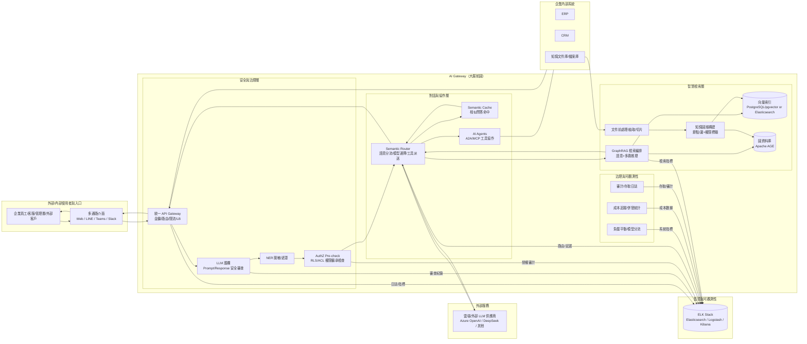

```mermaid
MK
flowchart LR
  %% 外部實體
  U[使用者群體<br/>員工/客服/管理層/外部客戶]
  CH[通路介面<br/>Web/LINE/Teams/Slack]
  SYS[企業內部系統<br/>ERP/CRM/知識文件庫]
  LLM[外部/雲端 LLM 服務]
  MON[監控與報表平臺<br/>ELK Stack]

  %% 系統（單一處理）
  G[(AI Gateway（大展航圖）)]

  %% 使用者互動
  U -->|"查詢/請求/回饋"| CH
  CH -->|"使用者請求（已連線）"| G
  G -->|"回應/通知/結果"| CH
  CH -->|"回覆展示"| U

  %% 對企業系統的整合
  SYS -->|"企業資料/知識文件/設定"| G
  G -->|"讀取/同步需求/查詢請求"| SYS

  %% 對外部 LLM 的交互
  G -->|"模型請求/推理任務"| LLM
  LLM -->|"推理結果/生成內容"| G

  %% 監控與治理輸出
  G -->|"日誌/指標/成本/審計事件"| MON
```
