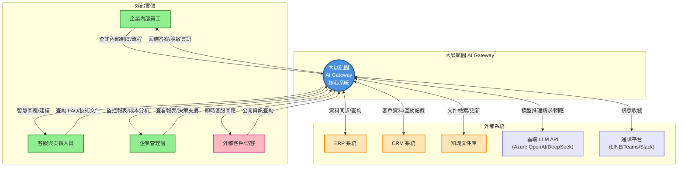

```mermaid
graph TB
    subgraph Users["使用者"]
        U1["企業員工"]
        U2["客服人員"]
        U3["管理層"]
        U4["外部客戶"]
    end
    
    subgraph AIGateway["大展航圖 AI Gateway 系統"]
        P1(("1.0<br/>安全與治理層<br/>(LLM護欄/NER脫敏/權限控管)"))
        P2(("2.0<br/>語意路由層<br/>(Semantic Router)"))
        P3(("3.0<br/>智慧檢索層<br/>(GraphRAG/向量檢索)"))
        P4(("4.0<br/>對話生成層<br/>(LLM/AI Agent)"))
        P5(("5.0<br/>快取管理層<br/>(Semantic Cache)"))
        P6(("6.0<br/>監控與治理層<br/>(ELK/成本追蹤)"))
    end
    
    subgraph DataStores["資料儲存"]
        D1[("D1: 知識圖譜<br/>(Graph DB)")]
        D2[("D2: 向量資料庫<br/>(Vector DB)")]
        D3[("D3: 快取資料庫<br/>(Cache DB)")]
        D4[("D4: 日誌資料庫<br/>(Log DB)")]
        D5[("D5: 權限資料庫<br/>(ACL/RLS)")]
    end
    
    subgraph External["外部系統"]
        E1["ERP/CRM/知識庫"]
        E2["雲端 LLM API"]
        E3["外部工具/插件"]
    end
    
    %% 使用者輸入流程
    U1 -->|原始查詢請求| P1
    U2 -->|客服問題| P1
    U3 -->|管理查詢/報表請求| P1
    U4 -->|公開資訊查詢| P1
    
    %% 安全與治理層處理
    P1 -->|脫敏後查詢| P2
    P1 <-->|權限驗證| D5
    P1 -->|安全日誌| D4
    
    %% 語意路由層
    P2 -->|檢索類請求| P3
    P2 -->|對話類請求| P4
    P2 -->|快取查詢| P5
    P2 -->|路由決策日誌| D4
    
    %% 智慧檢索層
    P3 <-->|圖譜查詢| D1
    P3 <-->|向量檢索| D2
    P3 -->|檢索結果| P4
    E1 -->|文件同步/更新| P3
    
    %% 對話生成層
    P4 <-->|模型推理| E2
    P4 <-->|工具調用| E3
    P4 -->|生成答案| P1
    P4 -->|新問答對| P5
    
    %% 快取管理層
    P5 <-->|快取讀寫| D3
    P5 -->|快取命中答案| P1
    
    %% 監控與治理層
    P1 -->|系統事件| P6
    P2 -->|路由統計| P6
    P3 -->|檢索統計| P6
    P4 -->|生成統計/成本| P6
    P6 -->|監控數據| D4
    P6 -->|報表/儀表板| U3
    
    %% 最終回應
    P1 -->|脫敏後答案| U1
    P1 -->|智慧回覆| U2
    P1 -->|決策資訊| U3
    P1 -->|公開回應| U4
    
    style P1 fill:#FF6B6B,stroke:#C92A2A,stroke-width:2px,color:#fff
    style P2 fill:#4ECDC4,stroke:#0B7285,stroke-width:2px,color:#fff
    style P3 fill:#45B7D1,stroke:#1971C2,stroke-width:2px,color:#fff
    style P4 fill:#96CEB4,stroke:#2F9E44,stroke-width:2px,color:#fff
    style P5 fill:#FFEAA7,stroke:#F59F00,stroke-width:2px
    style P6 fill:#DDA15E,stroke:#BC6C25,stroke-width:2px,color:#fff
    
    style D1 fill:#E8F5E9,stroke:#2E7D32,stroke-width:2px
    style D2 fill:#E3F2FD,stroke:#1565C0,stroke-width:2px
    style D3 fill:#FFF3E0,stroke:#E65100,stroke-width:2px
    style D4 fill:#F3E5F5,stroke:#6A1B9A,stroke-width:2px
    style D5 fill:#FFEBEE,stroke:#C62828,stroke-width:2px
````
