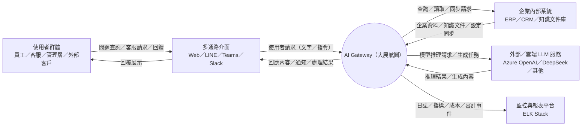
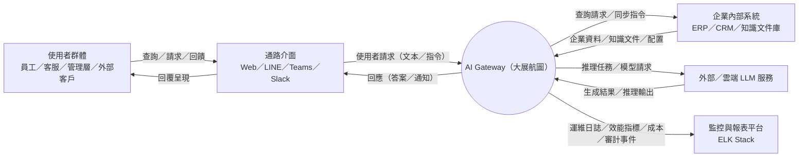

```mermaid
flowchart LR
  %% 外部實體（方形）
  U[使用者群體\n員工／客服／管理層／外部客戶]
  CH[多通路介面\nWeb／LINE／Teams／Slack]
  ES[企業內部系統\nERP／CRM／知識文件庫]
  LLM[外部／雲端 LLM 服務\nAzure OpenAI／DeepSeek／其他]
  MON[監控與報表平台\nELK Stack]

  %% 系統（單一流程，黑盒）
  G((AI Gateway（大展航圖）))

  %% 使用者互動（通路作為外部實體）
  U -->|"問題查詢／客服請求／回饋"| CH
  CH -->|"使用者請求（文字／指令）"| G
  G -->|"回應內容／通知／處理結果"| CH
  CH -->|"回覆展示"| U

  %% 與企業系統互動
  ES -->|"企業資料／知識文件／設定同步"| G
  G -->|"查詢／讀取／同步請求"| ES

  %% 與外部 LLM 互動
  G -->|"模型推理請求／生成任務"| LLM
  LLM -->|"推理結果／生成內容"| G

  %% 監控與治理輸出
  G -->|"日誌／指標／成本／審計事件"| MON
```

```mermaid
flowchart LR
  %% 外部實體
  U[使用者群體\n員工／客服／管理層／外部客戶]
  CH[通路介面\nWeb／LINE／Teams／Slack]
  SYS[企業內部系統\nERP／CRM／知識文件庫]
  LLM[外部／雲端 LLM 服務]
  ELK[監控與報表平台\nELK Stack]

  %% 系統（單一處理）
  G((AI Gateway（大展航圖）))

  %% 使用者與通路資料流
  U -->|"查詢／請求／回饋"| CH
  CH -->|"使用者請求（文本／指令）"| G
  G -->|"回應（答案／通知）"| CH
  CH -->|"回覆呈現"| U

  %% 與企業系統資料流
  SYS -->|"企業資料／知識文件／配置"| G
  G -->|"查詢請求／同步指令"| SYS

  %% 與外部 LLM 資料流
  G -->|"推理任務／模型請求"| LLM
  LLM -->|"生成結果／推理輸出"| G

  %% 監控與治理資料流
  G -->|"運維日誌／效能指標／成本／審計事件"| ELK
```
